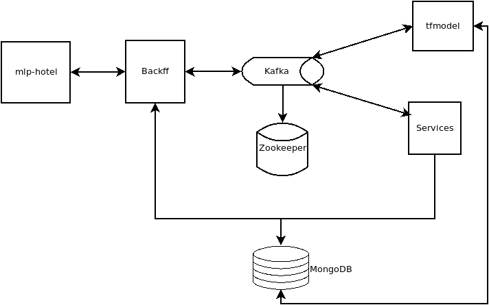

# Hotel Recomender

Trabalho de conclusão de curso do curso de MBA em Machine Learning in Production

## Execução

1. Criar o arquivo `.env` a partir do arquivo `.env-template`

2. build do angular em produção. Exemplo:

```console
ng build --configuration=production
```

3. Enviar para o docker:

```console
docker-compose up -d
```

## Arquitetura



### mlp-hotel

É o front-end feito em Angular, é a interface com o usuário.

### Backff (Back-end from Front)

É uma aplicação usando Python/FastAPI, é um microsserviço que lida com a entrada e saída dos dados com o front-end.

### Services

É uma aplicação em Python, um microsserviço que lida com o controle dos dados e armazenamento.

### tfmodel

É um microsserviço feito em Python que armazena o modelo de ML e realiza a classificação dos dados.